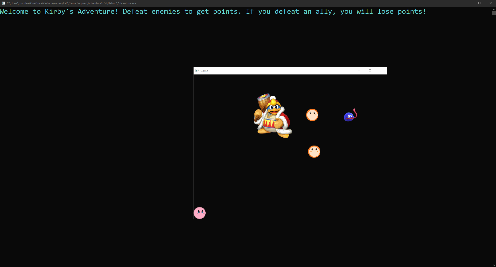

# Adventure Story Game Engine

Game Engines Project Fall 2021

This project utilizes GLFW, Glad, stbimage to create a basic game engine and functional game.

## Features

- User can control Kirby sprite to move around the screen.
- Sprites changed to different characters.
- Different sized enemies will spawn. 
- When the player defeats an enemy, a score is tallied. 
- When the player defeats an ally, score is deducted.
- Enemies will periodically despawn. 

## Basic Game Preview

## CMake

To utilize with CMAKE, build adventure.sln and run /Debug/adventure.exe

## Languages and Technologies 

- C 
- C++
- CMake
- Visual Studio
